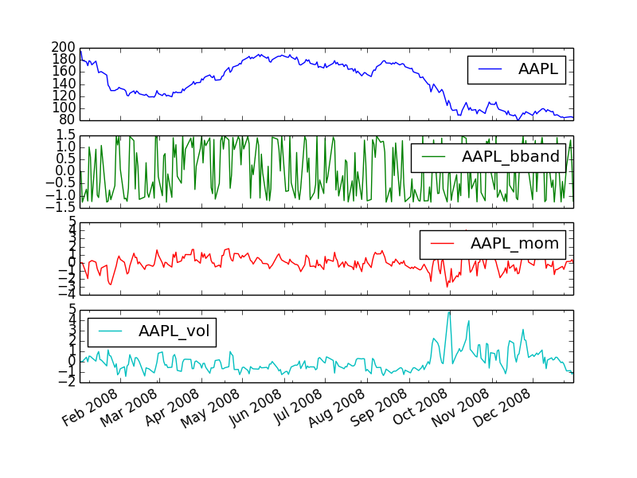

# Strategy-Learner
A Dyna Q-Learner that attempts to learn a trading strategy off reinforcement learning.

Q-learning parameters:

  - State: composition of bollinger bands, momentum, volatility
  - Actions: 0,1,2 for selling (short), holding, or buying (long)
  - Rewards: daily return

Please see  and  for the results.
